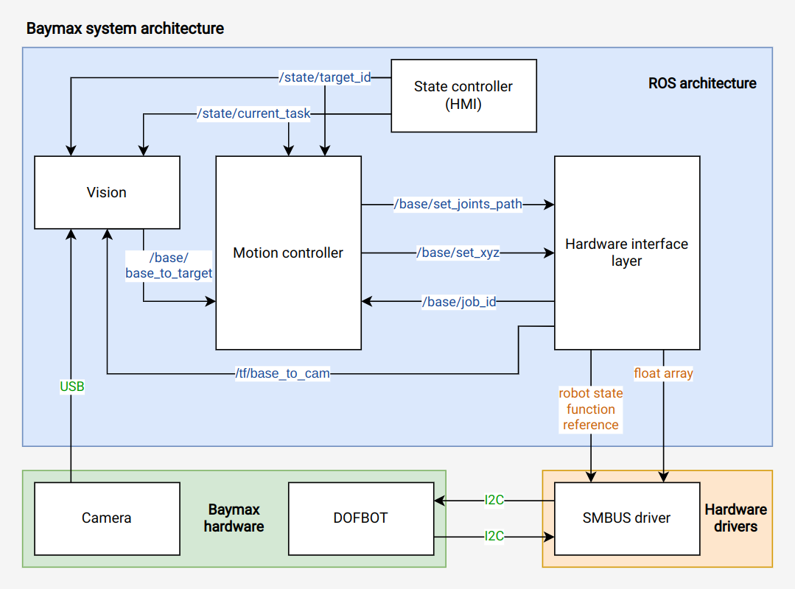

# ECSE 4480/6470 Robotics Project


ROS system architecture for ECSE 4480/6470 Robotics I final project at Rensselaer Polytechnic Institute

## Contributors

Chris Metcalfe: metcac@rpi.edu

Eric Sowalskie: sowale@rpi.edu

Hanson Ma: mah11@rpi.edu

Ryan Walton: waltor@rpi.edu

## Usage

For use on the DOFBOT in JEC 5312

Install ROS dependencies
```
sudo apt install ros-melodic-joy
```

All packages can be built from source by cloning our repository and building using `catkin`

```
git clone https://github.com/hansonhqma/baymax.git && cd ~/baymax/catkin_ws

catkin make

source devel/setup.bash
```

To run Baymax

```
sh launchall.sh
```

## System design

